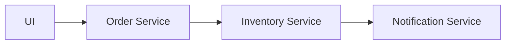

# Contract Testing Approach

## Service Flow

## Implementation Strategy

We want to test this flow using **contract testing** with [Pact](https://pact.io/) to create the contracts.

### Test Environment Setup

When testing the Order Service:
- We will use **Testcontainers** to start the Postgres database
- We will use **Pact stubs** to mock the Inventory Service — but not the Notification Service

This approach allows us to test the Order Service in isolation while ensuring that any changes to the real service contracts will be detected by the contract tests.

## Scope Limitations

### What Contract Tests Don't Test

- **Business logic** (covered by Unit tests)
- **Detailed DB integration** (or in Python, potentially no DB integration at all) — these are handled by Narrow Integration Tests
- **Error handling** (covered by Unit tests or framework-scoped narrow integration), OpenAPI generation, and similar aspects

## Challenges

### Current Limitations

1. **State Management in Mocks**: We need a way to change the state of stubbed mocks in Pact based on consumer-driven states.
   - For example, to simulate a scenario where a Product is unavailable, we can't simply change the Product state in the database; we need to modify the state of the Pact mock.

2. **Asynchronous Messaging**: Kafka or any async communication requires its own approach.
   - Potential solutions:
     - Pact modification
     - Specialized framework
     - Custom implementation

